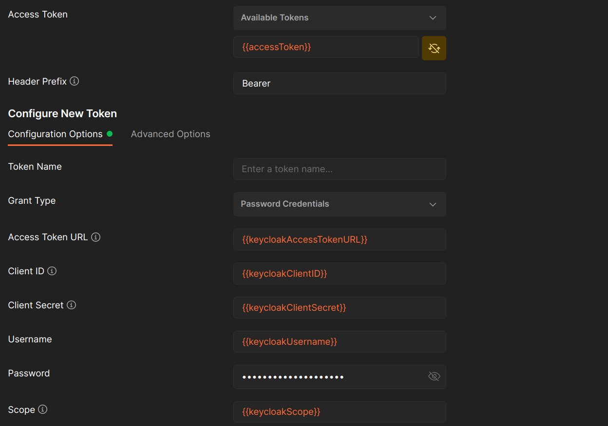
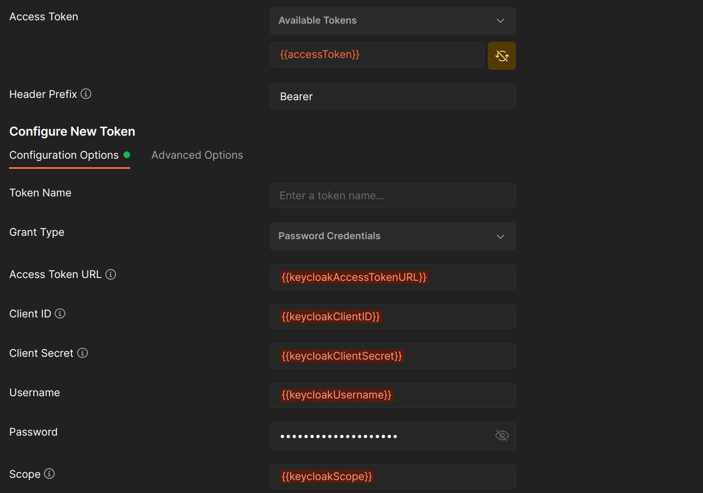
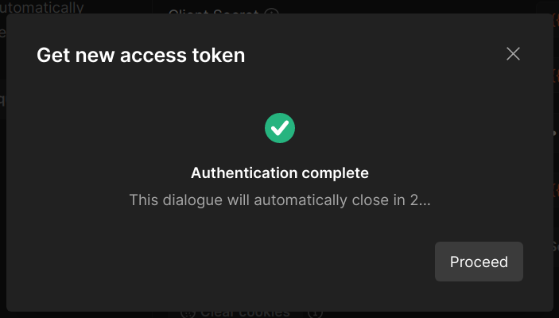
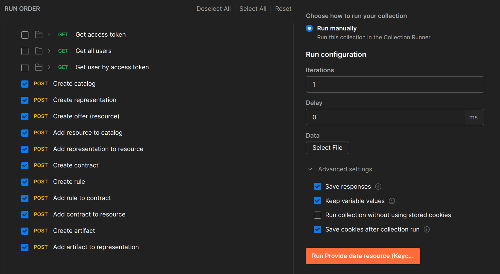
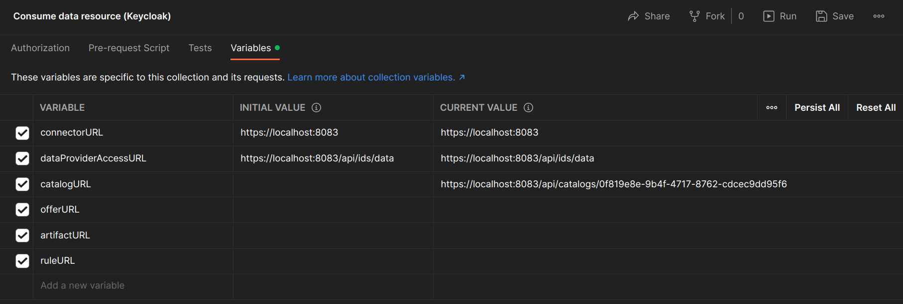

# Interacting With The Connector Through Keycloak
VTT is hosting their own Keycloak server that houses a connector realm and connector client, the collections provided are set to use this Keycloak instance. The communication is done by API requests and VTT suggests using Postman Desktop graphical user interface (GUI) to manage the collections and visualize the results.

[Document navigator](../docs/navigation_document.md)


## Prerequisite
* The VTT connector configured with Keycloak Security enabled

# Importing The Collections
* Open the Postman Desktop GUI
* Import the following collections
    * [Provide collection](../postman%20collections/Keycloak/Provide%20data%20resource%20(Keycloak).postman_collection.json)
    * [Consume collection](../postman%20collections/Keycloak/Consume%20data%20resource%20(Keycloak).postman_collection.json)
    * [Environment varaiable collections](../postman%20collections/Keycloak/Keycloak%20environment%20variables.postman_environment.json)
* For the requests we make use of Oauth 2.0 which works by authenticating a user by username and password, successful authentication will return a access token that is linkned to the authenticated user and the users roles. Note the access token expires after 10 minutes
* We also make use of user roles for the provided user we have granted full access however the user base role mapping can be configured to restrict access in a dynamic and intuitive manner
* Because of this access token we require the user to do one manual step and that is once the request collections are imported there should be two collections, one is a provider and the other is a consumer. Ensure that each request has a variable {{accessToken}} set under the "Authorization" tab and "Access Token" heading. As a security feature the value of the access token is removed when exporting the collection
* Ensure that the Environment variable collection is also selected

Checklist for this step, there should be two request collections (provide, and consume), there should also be one environment variable collection. Finally each request under the provide and consume collection should have a variable {{accessToken}} set. Use the image below as a reference.

Correct and enabled environment variables example


Incorrect and disabled environment variables example


You can do a small smoke test to ensure everything is correct, we have configured and provided a user (username:password) admin:admin which is already configured. To perform the smoke test execute the request "Get access token" which can be found under the Provide -> Keycloak directories. To execute this request open the "Get access token" request navigate to the "Authorization" tab of the request and scoll to the bottom of the tab window, locate the "Get New Access Token" button. If the connector is started and configured correctly along with the postman configuration you should see the the following pop up.  If you see this window we can then proceed to using the collection to provide and consume data with the VTT connector.

# Running the Provide Collection

(Note: ensure "{{accessToken}}" is set for all the requests you intend to run and the value is correct)

To interact with the VTT connector API's you need to have an active access token and you can provide a Keycloak user ID.

Getting an access token:
* Locate the "Get access token" request click on the "Get New Access Token" button copy the access token value into the environment variable collection provided and asign the value to the accessToken key value pair

Getting a Keycloak user ID:
* Locate either the "Get all users" or the "Get user by access token" request execute these requests with the "SEND" button, in the response body copy the ID value and assign it to "keycloakUserID" found in the environment varaible collection

Using Postman "Run collection" tool to automate the provide collection requests:
* Navigate to the Provide collection root
* Locate the three dots on the right of the collection name
* Select "Run collection" from the drop down
* In the new tab ensure all the POST requests have the checkbox as checked
* In the new tab ensure all the GET requests have thec checkbox as note checked
* Locate "Advances settings"
* Under "Advances settings" ensure the checkbox for "save responses" is checked
* The tab should look as follows 
* You can then click "Run Provide data resource ..."

By clicking this button you will execute all the requests and we have tests made that will collect and set the required variables under the collection variables.

(Note: please ensure that all requests have either a 200 or 201 status)

#  Running the Consume Collection
To run the consume collection requests you will need to have the specific values available for the following variables (catalogURL), they can be taken from the reponse body of the "Run collection" results, note that the values to be extracted are found under "response.body._links.self.href" for each request (catalogURL: Create catalog)

```
"_links": {
    "self": {
        "href": "https://localhost:8083/api/representations/c26f43cd-8984-4797-be15-1eced5b5c231"
    }
}
```

The consume collection is made up of three requests:
* Description request with catalogue
* Contract request
* Get artifact

These requests will be called in the order presented. To run the first request (Description request with catalogue), you will need to set the catalogURL after setting this value the consume environment variables should look as follows. 

The description request with catalogue can then be executed by the "SEND" button and if successful you should see content in the response body and also a status message of 200.

Next the following values must be set (offerURL: Create offer (resource), ruleURL: Create rule). These can be fetched from the "Run collection" response bodies of the apporpriate requests. Once these values have been set the "Contract request" can be made.

When a successful "Contract request" is made you can then extract the artficat id url and place it in the "Get artifact" request.

(Note: the Keycloak ID value keycloakUserID, will limit who can fetch or access the results, if you provide an incorrect user ID value you will not find the artifact)

For additional information a video has been made to help demonstrate this process [Keycloak demo]()