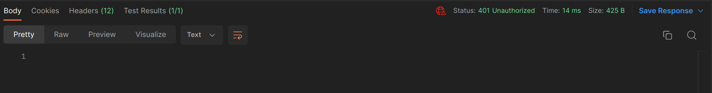
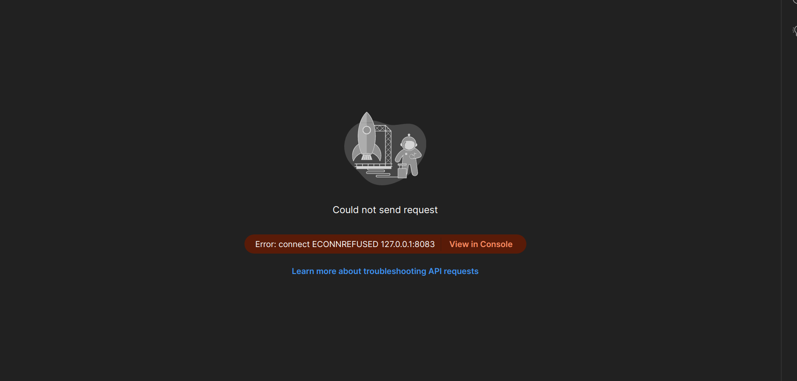

# Common errors and possible solutions

## Keycloak expired access token

## Keycloak incorrect username and or password

## Keycloak connector not running

## Spring incorrect username and or password

## Spring connector not running

